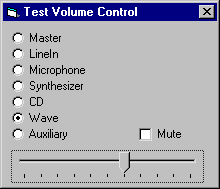



## A Volume Control OCX

### Description

This OCX allows you to control the volume of 7 devices (master, wave, line in, microphone, auxiliary, synthesizer, CD) without calling Standard Windows Volume control. Also reflects all the changes on the devices. Was not thoroughly tested, but works.
 
### More Info
 

             |
---                |---
**Submitted On**   |2001-02-20 15:19:02
**By**             |[Gene Martynov](https://github.com/Planet-Source-Code/PSCIndex/blob/master/ByAuthor/gene-martynov.md)
**Level**          |Intermediate
**User Rating**    |4.8 (87 globes from 18 users)
**Compatibility**  |VB 6\.0
**Category**       |[OLE/ COM/ DCOM/ Active\-X](https://github.com/Planet-Source-Code/PSCIndex/blob/master/ByCategory/ole-com-dcom-active-x__1-29.md)
**World**          |[Visual Basic](https://github.com/Planet-Source-Code/PSCIndex/blob/master/ByWorld/visual-basic.md)
**Archive File**   |[CODE\_UPLOAD152692202001\.zip](https://github.com/Planet-Source-Code/gene-martynov-a-volume-control-ocx__1-21206/archive/master.zip)

